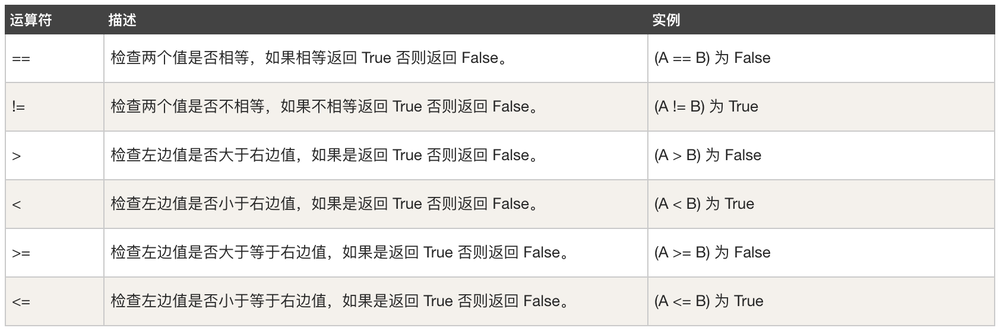

# day03 基础知识

## 今日概要

- switch case语句，条件判断。
- for循环语句，循环。
- goto语法，不太建议使用。
- 字符串格式化，“拼接”数据。
- 运算符


## 1.switch语句

```go
package main

func main() {

	// 表达式
	/*
		switch 1 + 1 {
		case 1:
			fmt.Println("等于1")
		case 2:
			fmt.Println("等于2")
		case 3:
			fmt.Println("等于3")
			fmt.Println("等于3")
		default:
			fmt.Println("都不满足")
		}
	*/
	// 变量
	/*
		var age int
		fmt.Scanln(&age)
		switch age {
		case "1":
			fmt.Println("等于1")
		case 2:
			fmt.Println("等于2")
		case 3:
			fmt.Println("等于3")
			fmt.Println("等于3")
		default:
			fmt.Println("都不满足")
		}
	*/
	// 注意事项: 数据类型一致的情况。 正确：1>2   3+4    错误： 1>"3"   5+"6"
}
```


## 2.for循环

### 2.1 死循环

```go
for {
    ...
}
```

### 2.2 布尔值条件

```go
for 1>2 {
    ...
}
```

```go
flag := true
for flag {
    
}
```

### 示例

```go
package main

func main() {

	// 示例1：死循环
	/*
		fmt.Println("开始")
		for {
			fmt.Println("红鲤鱼与绿鲤鱼与驴")
			time.Sleep(time.Second * 1) // 等一秒再继续执行
		}
		fmt.Println("结束")
	*/

	// 示例2：
	/*
		fmt.Println("开始")
		for 2 > 1 {
			fmt.Println("红鲤鱼与绿鲤鱼与驴")
			time.Sleep(time.Second * 1) // 等一秒再继续执行
		}
		fmt.Println("结束")
	*/

	// 示例3：
	/*

		fmt.Println("开始")
		number := 1
		for number < 5 {
			fmt.Println("钓鱼要掉刀鱼，刀鱼要到岛上钓")
			number = 10
		}
		fmt.Println("结束")
	*/

	// 示例4：
	/*
		fmt.Println("开始")
		number := 1
		for number < 5 {
			fmt.Println("钓鱼要掉刀鱼，刀鱼要到岛上钓")
			number = number + 1
		}
		fmt.Println("结束")

	*/

	// 示例5：布尔类型的变量
	/*
		fmt.Println("开始")
		flag := true
		for flag {
			fmt.Println("钓鱼要掉刀鱼，刀鱼要到岛上钓")
			flag = false
		}
		fmt.Println("结束")

	*/

}
```

### 2.3 变量&条件

```go
for i:=1;i<10; {
    fmt.Println("钓鱼要掉刀鱼，刀鱼要到岛上钓")
    i = i + 1
}
```

### 2.4 变量&条件&变量赋值

```go
for i:=1;i<10;i=i+1 {
    fmt.Println("钓鱼要掉刀鱼，刀鱼要到岛上钓")
}
// 简化为：
for i:=1;i<10;i++ {
    fmt.Println("钓鱼要掉刀鱼，刀鱼要到岛上钓")
}
```

```go
for i := 1; i < 10; i = i + 2 {
    fmt.Println("钓鱼要掉刀鱼，刀鱼要到岛上钓")
}
```


扩展：对于 i=i+1简写 --> `i++`

```go
num := 10
fmt.Println(num)
num++ // 等价于 num = num + 1
fmt.Println(num)
```

```go
num := 10
fmt.Println(num)
num-- // 等价于 num = num - 1
fmt.Println(num)
```


## 阶段练习题

1. 猜数字，设定一个理想数字比如：66，一直提示让用户输入数字，如果比66大，则显示猜测的结果大了；如果比66小，则显示猜测的结果小了;只有输入等于66，显示猜测结果正确，然后退出循环。
2. 使用循环输出1~100所有整数。
3. 使用循环输出 1 2 3 4 5 6 8 9 10，即：10以内除7以外的整数。
4. 输出 1~100 内的所有奇数。
5. 输出 1~100 内的所有偶数。
6. 求 1~100 的所有整数的和。
7. 输出10~1 所有整数。


### 2.5 continue

在for循环中，当循环遇到continue关键字时，会停止当前循环，开始下一次循环。

```go
for{
    fmt.Println("Alex今天不在家，沛齐你来陪我呀！！！")
    continue
    fmt.Println("让苑昊也一起来")
}
```

案例1：使用循环输出 1 2 3 4 5 6 8 9 10，即：10以内除7以外的整数。

```go
for i:=1;i<=10;i++{
    if i == 7{
        continue
    }
    fmt.Println(i)
}
```

案例2：for循环嵌套

```go
for i:=1;i<3;i++{
    // i=1
    // i=2
    for j:=1;j<5;j++{
        // j=1/2/3/4
        fmt.Println(i,j)
    }
}

>>> 输出：
1 1
1 2
1 3
1 4
2 1
2 2
2 3
2 4
```

案例3：for循环嵌套 + continue

```go
for i:=1;i<3;i++{
    // i=1
    // i=2
    for j:=1;j<5;j++{
        // j=1/2/3/4
        if j == 3{
            continue
        }
        fmt.Println(i,j)
    }
}

>>> 输出：
1 1
1 2
1 4
2 1
2 2
2 4
```


### 2.6 break

在for循环中时，循环中一旦遇到break，跳出循环。

```go
for{
    fmt.Println("王老汉、李老汉、张老汉")
    break
    fmt.Println("alex老婆满身大汗")
}
```

案例1：猜数字，设定一个理想数字比如：66，一直提示让用户输入数字，如果比66大，则显示猜测的结果大了；如果比66小，则显示猜测的结果小了;只有输入等于66，显示猜测结果正确，然后退出循环。

```go
fmt.Print("开始")
data := 66
for{
    var userInputNumber int
    fmt.Print("请输入数字：")
    fmt.Scanln(&userInputNumber)
    if userInputNumber > data {
        fmt.Println("大了")
    } else if userInputNumber < data {
        fmt.Println("小了")
    } else {
        fmt.Println("恭喜你猜对了")
        break
    }
}
fmt.Print("结束")
```

案例2：

```go
for i:=1;i<3;i++{
    // i=1
    // i=2
    for j:=1;j<5;j++{
        // j=1/2/3/4
        if j == 3{
            break
        }
        fmt.Println(i,j)
    }
}

>>> 输出：
1 1
1 2
2 1
2 2
```

```go
for i:=1;i<3;i++{
    // i=1
    // i=2
    for j:=1;j<5;j++{
        // j=1/2/3/4
        if j == 3{
            break
        }
        fmt.Println(i,j)
    }
    break
}

>>> 输出：
1 1
1 2
```


对for进行打标签，然后通过break和continue就可以实现多层循环的跳出和终止。

```go
f1:
	for i := 1; i < 3; i++ {
		// i=1
		// i=2
		for j := 1; j < 5; j++ {
			// j=1/2/3/4
			if j == 3 {
				continue f1
			}
			fmt.Println(i, j)
		}
	}

>>> 输出：
1 1
1 2
2 1
2 2
```

```go
f1:
	for i := 1; i < 3; i++ {
		// i=1
		// i=2
		for j := 1; j < 5; j++ {
			// j=1/2/3/4
			if j == 3 {
				break f1
			}
			fmt.Println(i, j)
		}
	}

>>> 输出：
1 1
1 2
```


## 3.goto语句

跳跃到指定的行，然后向下执行代码。

```go
package main

import "fmt"

func main() {
	var name string
	fmt.Print("请输入姓名：")
	fmt.Scanln(&name)

	if name == "wupeiqi" {
		// svip
		goto SVIP
	} else if name == "yuanhao" {
		// vip
		goto VIP
	}
	fmt.Println("预约...")
VIP:
	fmt.Println("等号...")
SVIP:
	fmt.Println("进入...")
}
```


## 4.字符串格式化

将数据格式化成为特定格式的字符串时，可以使用字符串格式化。

```go
package main

import "fmt"

func main() {
	var name, address, action string

	fmt.Print("请输入姓名：")
	fmt.Scanln(&name)

	fmt.Print("请输入位置：")
	fmt.Scanln(&address)

	fmt.Print("请输入行为：")
	fmt.Scanln(&action)

	result := fmt.Sprintf("我叫%s,在%s正在干%s", name, address, action)
	//result := "我叫" + name + "在" + address + "干" + action
	fmt.Println(result)
}

```


## 5.运算符

### 5.1 算数运算符


### 5.2 关系运算符




### 5.3 逻辑运算符


```go
if !true {
    fmt.Println("你是风儿我是沙，去你吗的风河沙")
}
```

### 5.4 位运算符


必知必会概念：

- 计算机中的 存储、运算、网络传输等任何的行为，本质上都是二进制的操作。例如：01010101。

  ```go
    A				                  B
  hello   -> 0101010010101  ->    hello
  ```

- 信息表现形式

  ```
  二进制表示：0101010010101   ->  hello
  十进制表示：1921            ->  hello
  ```

- 十进制和二进制的转换关系

  | 十进制 | 二进制 |
  | ------ | ------ |
  | 0      | 0      |
  | 1      | 1      |
  | 2      | 10     |
  | 3      | 11     |
  | 4      | 100    |
  | 5      | 101    |
  | 6      | 110    |
  | 7      | 111    |
  | 8      | 1000   |
  | 9      | 1001   |
  | 10     | 1010   |
  | ...    | ...    |

  - 二进制转换为十进制

    ```
    10101         ->   2**4 + 2**2 + 2**0 => 16 + 4 + 1 => 21
    101010010101  ->   2**11 + 2**9 + ....
    ```

  - 十进制转换成二进制

    ```
    99            -> 64 + 32 + 2 + 1  -> 2**6 + 2**5 + 2**1 + 2*0  -> 1100011
    ```

    

位运算指的是二进制之间的运算：

```go
// 1.按位进行与运算（全为1，才得1）
r1 := 5 & 99
5  -> 0000101
99 -> 1100011
      0000001   -> 1

// 2.按位进行或运算（只要有1，就得1）
r2 := 5 | 99
5  -> 0000101
99 -> 1100011
      1100111   -> 2**6 + 2**5 + 2**2 + 2**1 + 2**0 = 64 + 32 + 4 + 2 + 1 = 103

// 3.按位进行异或运算（上下不同，就得1）
r3 := 5 ^ 99
5  -> 0000101
99 -> 1100011
      1100110   -> 2**6 + 2**5 + 2**2 + 2**1 = 64 + 32 + 4 + 2 = 102

// 4.按位向左移动
r4 := 5 << 2
        5  -> 101
向左移动2位  -> 10100  -> 2**4 + 2**2 = 16 + 4 = 20

// 5.按位向右移动
r5 := 5 >> 1
        5  -> 101
向右移动1位  -> 10  -> 2**1 = 2

// 6.比较清除   // 以前面的值为基准，让前面的和后面的值的二进制位进行比较，如果两个位置都是1，则讲前面的值的那个位置置0
r6 := 5 &^ 99
5  -> 0000101
99 -> 1100011
      0000100     -> 2**2 = 4
```


### 5.5 赋值运算符


```go
age := 19
age = 99

age = age + 9  // age+=9
age = age - 9  // age-=9
age = age * 9  // age*=9
...
```

### 运算符的优先级

```
Precedence    Operator
    5             *  /  %  <<  >>  &  &^
    4             +  -  |  ^
    3             ==  !=  <  <=  >  >=
    2             &&
    1             ||
```

```go
v1 := 3 + 2 * 2
v2 := 8 == 5 & 99
```

注意：不要想办法去记住他，使用括号。

参考地址：

- https://golang.org/ref/spec#Arithmetic_operators
- https://www.runoob.com/go/go-operators.html


叮嘱：不要太过于用心去背、记，主要认识即可。优先级记不住就用括号。


## 今日作业

1. 猜年龄游戏，要求：允许用户最多尝试3次，3次都没猜对的话，就直接退出，如果猜对了，打印恭喜信息并退出。
2. 实现用户登录系统，并且要支持连续3次输错之后直接退出，并且在每次输错误时显示剩余错误次数（提示：使⽤字符串格式化）。


