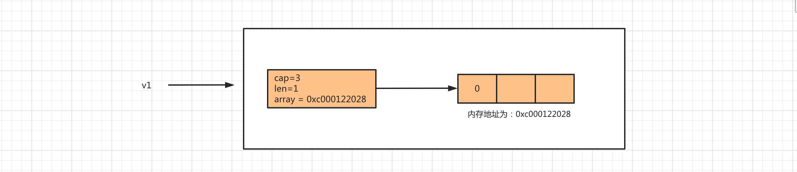
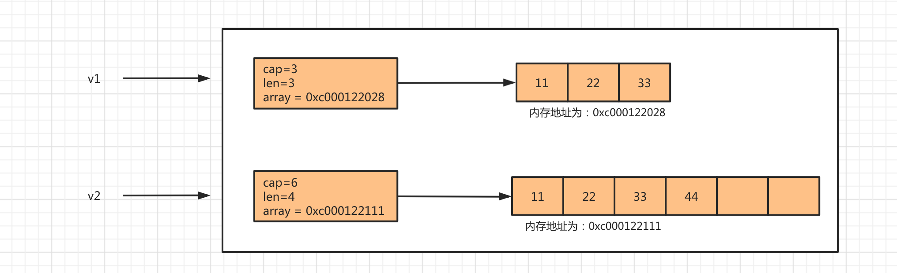
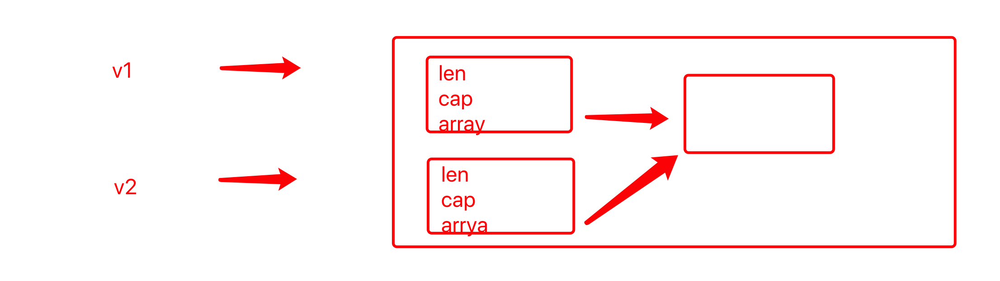
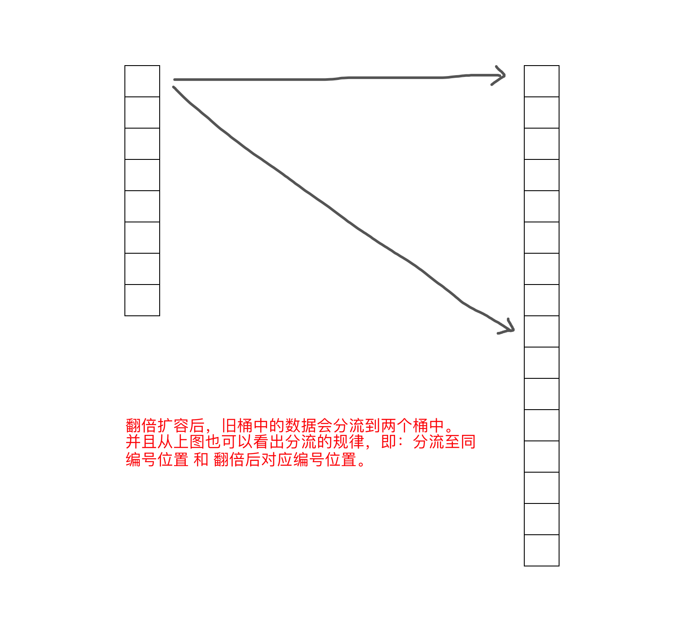
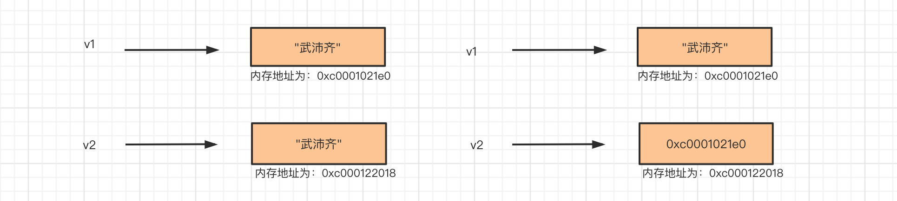
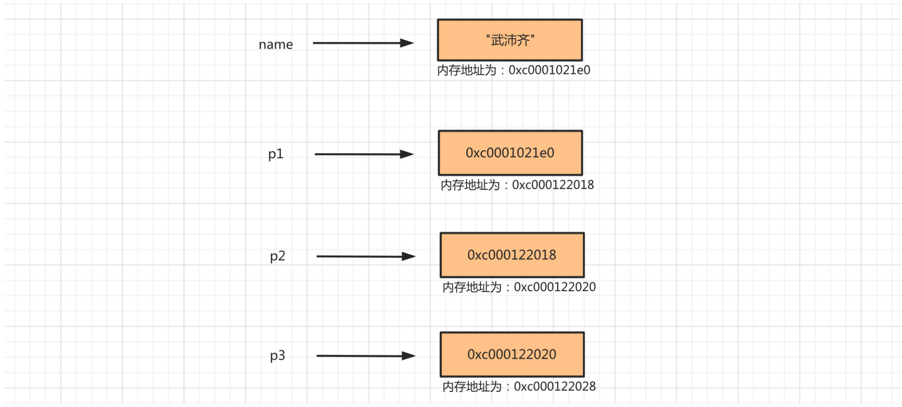
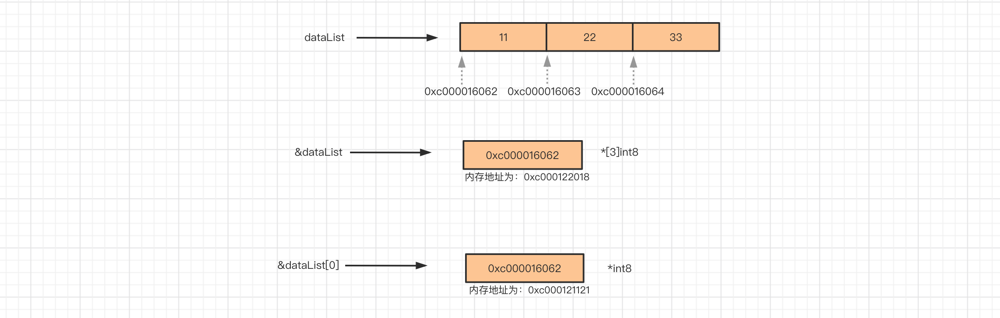

# day06 数据类型

Go语言中常见的数据类型有很多，例如：

- <span style="color:gray">整型，用于表示整数。</span>
- <span style="color:gray">浮点型，用于表示小数。</span>
- <span style="color:gray">布尔型，用于表示真/假。</span>
- <span style="color:gray">字符串，用于表示文本信息。</span>
- <span style="color:gray">数组，用于表示多个数据（数据集合）</span>
- **指针，用于表示内存地址的类型。**
- **切片，用于表示多个数据（数据集合）**
- **字典，用于表示键值对结合。**
- <span style="color:gray">结构体，用于自定义一些数据集合。</span>
- <span style="color:gray">接口，用于约束和泛指数据类型。</span>


## 今日概要

- 切片，用于表示多个数据（数据集合），可以理解为动态数组。 [alex,18,3]
- 字典，键值对。例如：{ "name":"武沛齐"," age":"18", "len":"21" }
- 指针，用于表示内存地址的类型。


## 1. 切片

切片，动态数组。

切片是Go中重要的数据类型，每个切片对象内部都维护着：数组指针、切片长度、切片容量 三个数据。

```go
type slice struct {
	array unsafe.Pointer
	len   int
	cap   int
}
```


在向切片中追加的数据个数大于容量时，内部会自动扩容且每次扩容都当前容量的2倍（当容量超过1024时每次扩容则只增加 1/4容量）。

### 1.1 创建切片

```go
// 创建切片
var nums []int

// 创建切片
var data = []int{11,22,33}
data:= []int{11,22,33}

// 创建切片
// make只用于 切片、字典、channel
var users = make([]int,1,3)
```

```go
// 切片的指针类型
var v1 = new([]int)

// 指针类型(nil)
var v2 *[]int
```

### 1.2 自动扩容

```go
v1 := make([]int,1,3)

fmt.Println(len(v1),cap(v1))

// 其他
data := make([]int,3)
```



```go
v1 := make([]int,1,3)

v2 := append(v1,66)

fmt.Println(v1)  // [0 ]
fmt.Println(v2)  // [0,66]

v1[0] = 999
fmt.Println(v1)  // [999 ]
fmt.Println(v2)  // [999,66]

// 需求：有一个切片，请往一个切片中追加一个数据。
v3 := make([]int,1,3)
v3 = append(v3,999)
```


```go
v1 := []int{11,22,33}
v2 := append(v1,44)

v1[0] = 999

fmt.Println(v1) // [999 22 33]
fmt.Println(v2) // [11 22 33 44]
```




### 1.3 常见操作

#### 1.3.1 长度和容量

```go
v1 := []int{11,22,33}
fmt.Println(len(v1), cap(v1))
```


#### 1.3.2 索引

```go
v1 := []string{"alex","李杰","老男孩"}
v1[0]
v1[1]
v1[2]

v2 := make([]int,2,5)
v2[0]
v2[1]
v2[2]  // 报错


v2[0] = 999
```


#### 1.3.3 切片

```go
v1 := []int{11,22,33,44,55,66}

v2 := v1[1:3]
v3 := v1[1:]
v4 := v1[:3]

// 注意：通过切片切出来的数据和原切片内部存储的数据地址相同
```


#### 1.3.4 追加

```go
/*
 @Author:武沛齐  微信号：wupeiqi666
 @Description: 老男孩IT教育 & 路飞学城
 @Video:  https://space.bilibili.com/283478842
*/
package main

import (
	"fmt"
)

func main() {
	v1 := []int{11,22,33}

	v2 := append(v1,44)

	v3 := append(v1,55,66,77,88)

	v4 := append(v1, []int{100,200,300}...)

	fmt.Println(v2)
	fmt.Println(v3)
	fmt.Println(v4)
}

>>> 输出
[11 22 33 44]
[11 22 33 55 66 77 88]
[11 22 33 100 200 300]
```


#### 1.3.5 删除

```go
/*
 @Author:武沛齐  微信号：wupeiqi666
 @Description: 老男孩IT教育 & 路飞学城
 @Video:  https://space.bilibili.com/283478842
*/
package main

import "fmt"

func main() {
	v1 := []int{11, 22, 33, 44, 55, 66}
	deleteIndex := 2

	// 切片获取到 {11,22,44、55、66}
	// 又获取到 {44, 55, 66}，将44、55、66要追加到
	result := append(v1[:deleteIndex], v1[deleteIndex+1:]...)
	fmt.Println(result) // [11 22 44 55 66]
	fmt.Println(v1)     //[11 22 44 55 66 66]
}
```

注意：使用切片时不太会使用删除。【链表】


#### 1.3.6 插入

```go
/*
 @Author:武沛齐  微信号：wupeiqi666
 @Description: 老男孩IT教育 & 路飞学城
 @Video:  https://space.bilibili.com/283478842
*/
package main

import "fmt"

func main() {
	v1 := []int{11, 22, 33, 44, 55, 66}
	insertIndex := 3 // 在索引3的位置插入99

	result := make([]int, 0, len(v1)+1)
	result = append(result, v1[:insertIndex]...)
	result = append(result,99)
	result = append(result,v1[insertIndex:]...)
	fmt.Println(result)
}

```

注意：效率低下。【链表】


#### 1.3.7 循环

```go
/*
 @Author:武沛齐  微信号：wupeiqi666
 @Description: 老男孩IT教育 & 路飞学城
 @Video:  https://space.bilibili.com/283478842
*/
package main

import "fmt"

func main() {
	v1 := []int{11, 22, 33, 99, 55, 66}

	for i := 0; i < len(v1); i++ {
		fmt.Println(i, v1[i])
	}

	for index, value := range v1 {
		fmt.Println(index, value)
	}
}
```


### 1.4 切片嵌套

```go
/*
 @Author:武沛齐  微信号：wupeiqi666
 @Description: 老男孩IT教育 & 路飞学城
 @Video:  https://space.bilibili.com/283478842
*/
package main

import "fmt"

func main() {
	v1 := []int{11, 22, 33, 99, 55, 66}
	v2 := [][]int{[]int{11, 22, 33, 44}, []int{44, 55}}
	v3 := [][2]int{[2]int{1, 2}, [2]int{4, 5}}

	fmt.Println(v1)
	fmt.Println(v2)
	fmt.Println(v3)

	v1[0] = 111111
	v2[0][2] = 222222
	v3[1][0] = 99999

	fmt.Println(v1)
	fmt.Println(v2)
	fmt.Println(v3)
}
```


### 1.5 变量赋值

- 整型

  ```go
  /*
   @Author:武沛齐  微信号：wupeiqi666
   @Description: 老男孩IT教育 & 路飞学城
   @Video:  https://space.bilibili.com/283478842
  */
  package main
  
  import "fmt"
  
  func main() {
  	v1 := 1
  	v2 := v1
  
  	fmt.Printf("v1的内存地址：%p \n", &v1) // 0xc0000b4008
  	fmt.Printf("v2的内存地址：%p \n", &v2) // 0xc0000b4010
  }
  ```

- 布尔类型

  ```go
  /*
   @Author:武沛齐  微信号：wupeiqi666
   @Description: 老男孩IT教育 & 路飞学城
   @Video:  https://space.bilibili.com/283478842
  */
  package main
  
  import "fmt"
  
  func main() {
  	v1 := false
  	v2 := v1
  
  	fmt.Printf("v1的内存地址：%p \n", &v1) // 0xc00012a002
  	fmt.Printf("v2的内存地址：%p \n", &v2) // 0xc00012a003
  }
  ```

- 浮点型

  ```go
  /*
   @Author:武沛齐  微信号：wupeiqi666
   @Description: 老男孩IT教育 & 路飞学城
   @Video:  https://space.bilibili.com/283478842
  */
  package main
  
  import "fmt"
  
  func main() {
  	v1 := 3.14
  	v2 := v1
  
  	fmt.Printf("v1的内存地址：%p \n", &v1) // 0xc000016050
  	fmt.Printf("v2的内存地址：%p \n", &v2) // 0xc000016058
  }
  
  ```

- 字符串

  ```go
  /*
   @Author:武沛齐  微信号：wupeiqi666
   @Description: 老男孩IT教育 & 路飞学城
   @Video:  https://space.bilibili.com/283478842
  */
  package main
  
  import "fmt"
  
  func main() {
  	v1 := "武沛齐"
  	v2 := v1
  
  	fmt.Printf("v1的内存地址：%p \n", &v1) // 0xc000010200
  	fmt.Printf("v2的内存地址：%p \n", &v2) // 0xc000010210 
  }
  ```

  
  注意：字符串内部元素不可被修改。


- 数组

  ```go
  /*
   @Author:武沛齐  微信号：wupeiqi666
   @Description: 老男孩IT教育 & 路飞学城
   @Video:  https://space.bilibili.com/283478842
  */
  package main
  
  import "fmt"
  
  func main() {
  	v1 := [2]int{6, 9}
  	v2 := v1
  	fmt.Println(v1, v2)
  	fmt.Printf("v1的内存地址：%p \n", &v1) // 0xc0000b4010
  	fmt.Printf("v2的内存地址：%p \n", &v2) // 0xc0000b4020
  
  	v1[0] = 11111
  	fmt.Println(v1, v2)
  }
  
  ```

- 切片

  ```go
  /*
   @Author:武沛齐  微信号：wupeiqi666
   @Description: 老男孩IT教育 & 路飞学城
   @Video:  https://space.bilibili.com/283478842
  */
  package main
  
  import "fmt"
  
  func main() {
  	v1 := []int{6, 9}
  	v2 := v1
  	fmt.Println(v1, v2)              // [6 9] [6 9]
  	fmt.Printf("v1的内存地址：%p \n", &v1) // 0xc0000a6020
  	fmt.Printf("v2的内存地址：%p \n", &v2) // 0xc0000a6040
  
  	v1[0] = 11111
  	fmt.Println(v1, v2) // [11111 9] [11111 9]
  }
  
  ```

  
  如果扩容，那么内部存储数据的数组就会重新开辟区域。

  ```go
  package main
  
  import "fmt"
  
  func main() {
  	v1 := []int{6, 9}
  	v2 := v1
  	fmt.Println(v1, v2)              // [6 9] [6 9]
  	fmt.Printf("v1的内存地址：%p \n", &v1) // 0xc0000a6020
  	fmt.Printf("v2的内存地址：%p \n", &v2) // 0xc0000a6040
  
  	v1 = append(v1, 999)
  	fmt.Println(v1, v2) // [11111 9] [11111 9]
  }
  
  ```


总结，目前所学的所有的数据类型中，在修改切片的内部元素时，会造成所有的赋值的变量同时修改（不扩容）。

扩展：`引用类型和值类型`。


### 1.6 练习题

1. 简述切片和数组的区别？

2. 简述new和make的区别？

3. 看代码写结果

   ```go
   v1 := make([]int,2,5)
   fmt.Println(v1[0],len(v1),cap(v1))
   ```

4. 看代码写结果

   ```go
   v1 := make([]int,2,5)
   v2 := append(v1,123)
   
   fmt.Println(len(v1),cap(v1)) // 2,5
   fmt.Println(len(v2),cap(v2)) // 3,5
   fmt.Println(v1) // [0 0]
   fmt.Println(v2) // [0 0 123]
   ```

   

5. 看代码写结果

   ```go
   v1 := make([]int,2,5)
   v2 := append(v1,123)
   v1[0] = 999
   
   fmt.Println(v1) // [999 0]
   fmt.Println(v2) // [999, 0, 123]
   ```

6. 看代码写结果

   ```go
   v1 := make([]int,2,2)
   v2 := append(v1,123)
   v1[0] = 999
   
   fmt.Println(v1) // [999 0]
   fmt.Println(v2) // [0 0 123]
   ```

   

7. 看代码写结果

   ```go
   v1 := make([]int,2,2)
   v2 := v1[0:2]
   
   v1[0] = 111
   
   fmt.Println(v1) // [111,0]
   fmt.Println(v2) // [111,0]
   ```

8. 看代码写结果

   ```go
   v1 := [][]int{ []int{11, 22, 33, 44},  []int{44, 55} }
   v1[0][2] = 999
   fmt.Println(v1) // [ [11 22 99 44]  [44,55] ]
   ```

9. 看代码写结果

   ```go
   v1 := [][]int{[]int{11, 22, 33, 44}, []int{44, 55}}
   v2 := v1[0]
   
   v2[2] = 69
   fmt.Println(v1)  // [[11 22 69 44] [44 55]]
   ```

10. 看代码写结果

    ```go
    v1 := [][]int{[]int{11, 22, 33, 44}, []int{44, 55}}
    v2 := append(v1[0],99)
    
    v2[2] = 69
    fmt.Println(v1) // [[11 22 33 44] [44 55]]
    ```

11. 看代码写结果

    ```go
    v1 := [][]int{ make([]int, 2, 5), make([]int, 2, 3) }
    v2 := append(v1[0], 99)
    
    fmt.Println(v1) // [ [0 0], [0 0 ] ]
    fmt.Println(v2) // [0 0 99]
    
    v2[0] = 69
    fmt.Println(v1) // [ [69 0], [0 0 ] ]
    fmt.Println(v2) // [69 0 99]
    ```

    

## 2.字典类型（Map）

在学习任何的编程语言时，一般都会一种数据类型称为：字典(dict)或映射(map)，以键值对为元素的数据集合。例如：

```go
{
	"age":"18",
	"name":"武沛齐",
	"email":"wupeiqi@live.com"
}
```

这种类型最大的特点就是查找速度非常快，因为他的底层存储是基于哈希表存储的（不同语言还会有一些差异）。

以`取模+拉链法`来快速了解下哈希表存储原理，如下图：


这种结构之所以快，是因为根据key可以直接找到数据存放的位置；而其他的数据类型是需要从前到后去逐一比对，相对来说比较耗时。

以上只是基本的存储模型，而各个编程语言中的字典都会在此基础上进行相应的修改和优化（后续会深入讲解Golang中的map实现机制）。

Map的特点：

- 键不能重复
- 键必须可哈希（目前我们已学的数据类型中，可哈希的有：int/bool/float/string/array）
- 无序

接下来关于map我会从两个维度来进行讲解：

- 常见使用
- 底层原理剖析（面试常问）

### 2.1 声明&初始化

```go
// userInfo := map[string]string{}
userInfo := map[string]string{"name":"武沛齐","age":"18"}

userInfo["name"]  // 武沛齐
userInfo["age"] = "20"
userInfo["email"] = "wupeiqi@live.com"
```

```go
// data := make(map[int]int, 10)
data := make(map[int]int)
data[100] = 998
data[200] = 999
```

```go
data := make(map[string]int)
data["100"] = 998
data["200"] = 999

// 声明，nil
var row map[string]int
row = data
```

```go
data := make(map[string]int)
data["100"] = 998
data["200"] = 999

// 声明，nil
value := new(map[string]int)
// value["k1"] = 123  # 报错
value = &data
```

注意：键不重复 & 键必须可哈希（int/bool/float/string/array）

```go
v1 := make(map[[2]int]float32)
v1[[2]int{1,1}] = 1.6
v1[[2]int{1,2}] = 3.4

v2 := make(map[[2]int][3]string )
v2[[2]int{1,1}] = [3]string{"武沛齐","alex","老妖"}
```

### 2.2 常用操作

#### 2.2.1 长度和容量

```go
data := map[string]string{"n1":"武沛齐","n2":"alex"}
value := len(data)  // 2
```

```go
// 根据参数值（10），计算出合适的容量。
// 一个map 中会包含很多桶，每个桶中可以存放8个键值对。
info := make(map[string]string, 10)

info["n1"] = "武沛齐"
info["n2"] = "alex"

v1 := len(info)  // 2
// v2 := cap(info)  // 报错
```

#### 2.2.2 添加

```go
data := map[string]string{"n1":"武沛齐","n2":"alex"}
data["n3"] = "eric"
```

#### 2.2.3 修改

```go
data := map[string]string{"n1":"武沛齐","n2":"alex"}
data["n1"] = "eric"
```

#### 2..2.4 删除

```go
data := map[string]string{"n1":"武沛齐","n2":"alex"}
delete(data,"n2")
```

#### 2.2.5 查看

```go
data := map[string]string{"n1":"武沛齐","n2":"alex"}
data["n1"]
```

```go
data := map[string]string{"n1":"武沛齐","n2":"alex"}
for key,value := range data{
    fmt.Println(key,value)
}
```

```go
data := map[string]string{"n1":"武沛齐","n2":"alex"}
for key := range data{
    fmt.Println(key) 
}
```

```go
data := map[string]string{"n1": "武沛齐", "n2": "alex"}
for _, value := range data {
    fmt.Println(value)
}
```

#### 2.2.6 嵌套

```go
v1 := make(map[string]int)
v2 := make(map[string]string)
v3 := make(map[string]...)
v4 := make(map[string][2]int)
v5 := make(map[string][]int)
v6 := make(map[string]map[int]int)
```

```go
v7 := make(map[string][2]map[string]string)
v7["n1"] = [2]map[string]string{ map[string]string{"name":"武沛齐","age":"18"},map[string]string{"name":"alex","age":"78"}}
v7["n2"] = [2]map[string]string{ map[string]string{"name":"eric","age":"18"},map[string]string{"name":"seven","age":"78"}}

// 伪代码
v7 = {
    n1:[
        {"name":"武沛齐","age":"18"},
        {"name":"alex","age":"78"}
    ],
    n2:[
        {"name":"eric","age":"18"},
        {"name":"seven","age":"78"}
    ]
}
```

前提：键不重复 & 键必须可哈希

```go
v8 := make(map[int]int)
v9 := make(map[string]int)
v10 := make(map[float32]int)
v11 := make(map[bool]int)
v12 := make(map[ [2]int ]int)
v13 := make(map[ []int ]int) // 错误,不可哈希
v14 := make(map[ map[int]int ]int) // 错误，不可哈希
v15 := make(map[ [2][]int ]int) // 报错
v16 := make(map[ [2]map[string]string ]int) // 报错
```

#### 2.2.7 变量赋值

```go
v1 := map[string]string{"n1":"武沛齐","n2":"alex"}
v2 := v1

v1["n1"] = "wupeiqi"

ftm.Println(v1) // {"n1":"wupeiqi","n2":"alex"}
ftm.Println(v2) // {"n1":"wupeiqi","n2":"alex"}
```

特别提醒：无论是否存在扩容都指向同一个地址。

### 2.3 Map底层原理剖析

Golang中的Map有自己的一套实现原理，其核心是由`hmap`和`bmap`两个结构体实现。


#### 2.3.1 初始化

```go
// 初始化一个可容纳10个元素的map
info = make(map[string]string,10)
```

- 第一步：创建一个hmap结构体对象。

- 第二步：生成一个哈希因子hash0 并赋值到hmap对象中（用于后续为key创建哈希值）。

- 第三步：根据hint=10，并根据算法规则来创建 B，当前B应该为1。

  ```
  hint            B
  0~8				0
  9~13            1
  14~26           2
  ...
  ```

- 第四步：根据B去创建去创建桶（bmap对象）并存放在buckets数组中，当前bmap的数量应为2.

  - 当B<4时，根据B创建桶的个数的规则为：$2^B$（标准桶）
  - 当B>=4时，根据B创建桶的个数的规则为：$2^B$ + $2^{B-4}$（标准桶+溢出桶）

  注意：每个bmap中可以存储8个键值对，当不够存储时需要使用溢出桶，并将当前bmap中的overflow字段指向溢出桶的位置。


#### 2.3.2 写入数据

```go
info["name"] = "武沛齐"
```

在map中写入数据时，内部的执行流程为：

- 第一步：结合哈希因子和键 `name`生成哈希值 `011011100011111110111011011`。

- 第二步：获取哈希值的`后B位`，并根据后B为的值来决定将此键值对存放到那个桶中（bmap）。

  ```
  将哈希值和桶掩码（B个为1的二进制）进行 & 运算，最终得到哈希值的后B位的值。假设当B为1时，其结果为 0 ：
  哈希值：011011100011111110111011010
  桶掩码：000000000000000000000000001
  结果：  000000000000000000000000000 = 0
  
  通过示例你会发现，找桶的原则实际上是根据后B为的位运算计算出 索引位置，然后再去buckets数组中根据索引找到目标桶（bmap)。
  ```

- 第三步：在上一步确定桶之后，接下来就在桶中写入数据。

  ```
  获取哈希值的tophash（即：哈希值的`高8位`），将tophash、key、value分别写入到桶中的三个数组中。
  如果桶已满，则通过overflow找到溢出桶，并在溢出桶中继续写入。
  
  注意：以后在桶中查找数据时，会基于tophash来找（tophash相同则再去比较key）。
  ```

- 第四步：hmap的个数count++（map中的元素个数+1）


#### 2.3.3 读取数据

```go
value := info["name"]
```

在map中读取数据时，内部的执行流程为：

- 第一步：结合哈希引子和键 `name`生成哈希值。

- 第二步：获取哈希值的`后B位`，并根据后B为的值来决定将此键值对存放到那个桶中（bmap）。

- 第三步：确定桶之后，再根据key的哈希值计算出tophash（高8位），根据tophash和key去桶中查找数据。

  ```
  当前桶如果没找到，则根据overflow再去溢出桶中找，均未找到则表示key不存在。
  ```


#### 2.3.4 扩容

在向map中添加数据时，当达到某个条件，则会引发字典扩容。

扩容条件：

- map中数据总个数 / 桶个数  >  6.5 ，引发翻倍扩容。
- 使用了太多的溢出桶时（溢出桶使用的太多会导致map处理速度降低）。
  - B <=15，已使用的溢出桶个数 >= $2^B$ 时，引发等量扩容。
  - B > 15，已使用的溢出桶个数 >= $2^{15}$ 时，引发等量扩容。

```go
func hashGrow(t *maptype, h *hmap) {
	// If we've hit the load factor, get bigger.
	// Otherwise, there are too many overflow buckets,
	// so keep the same number of buckets and "grow" laterally.
	bigger := uint8(1)
	if !overLoadFactor(h.count+1, h.B) {
		bigger = 0
		h.flags |= sameSizeGrow
	}
	oldbuckets := h.buckets
	newbuckets, nextOverflow := makeBucketArray(t, h.B+bigger, nil)
	...
}
```

当扩容之后：

- 第一步：B会根据扩容后新桶的个数进行增加（翻倍扩容新B=旧B+1，等量扩容 新B=旧B）。
- 第二步：oldbuckets指向原来的桶（旧桶）。
- 第三步：buckets指向新创建的桶（新桶中暂时还没有数据）。
- 第四步：nevacuate设置为0，表示如果数据迁移的话，应该从原桶（旧桶）中的第0个位置开始迁移。
- 第五步：noverflow设置为0，扩容后新桶中已使用的溢出桶为0。
- 第六步：extra.oldoverflow设置为原桶（旧桶）已使用的所有溢出桶。即：`h.extra.oldoverflow = h.extra.overflow`
- 第七步：extra.overflow设置为nil，因为新桶中还未使用溢出桶。
- 第八步：extra.nextOverflow设置为新创建的桶中的第一个溢出桶的位置。


#### 2.3.5 迁移

扩容之后，必然要伴随着数据的迁移，即：将旧桶中的数据要迁移到新桶中。

##### 翻倍扩容

如果是翻倍扩容，那么迁移规就是将旧桶中的数据分流至新的两个桶中（比例不定），并且桶编号的位置为：同编号位置 和 翻倍后对应编号位置。



那么问题来了，如何实现的这种迁移呢？

首先，我们要知道如果翻倍扩容（数据总个数 / 桶个数  >  6.5），则新桶个数是旧桶的2倍，即：map中的B的值要+1（因为桶的个数等于$2^B$，而翻倍之后新桶的个数就是$2^B$ * 2 ，也就是$2^{B+1}$，所以 `新桶的B的值=原桶B + 1` ）。

迁移时会遍历某个旧桶中所有的key（包括溢出桶），并根据key重新生成哈希值，根据哈希值的 `底B位` 来决定将此键值对分流道那个新桶中。


扩容后，B的值在原来的基础上已加1，也就意味着通过多1位来计算此键值对要分流到新桶位置，如上图：

- 当新增的位（红色）的值为 0，则数据会迁移到与旧桶编号一致的位置。
- 当新增的位（红色）的值为 1，则数据会迁移到翻倍后对应编号位置。

例如：

```
旧桶个数为32个，翻倍后新桶的个数为64。
在重新计算旧桶中的所有key哈希值时，红色位只能是0或1，所以桶中的所有数据的后B位只能是以下两种情况：
	- 000111【7】，意味着要迁移到与旧桶编号一致的位置。
	- 100111【39】，意味着会迁移到翻倍后对应编号位置。
	
特别提醒：同一个桶中key的哈希值的低B位一定是相同的，不然不会放在同一个桶中，所以同一个桶中黄色标记的位都是相同的。
```


##### 等量扩容

如果是等量扩容（溢出桶太多引发的扩容），那么数据迁移机制就会比较简单，就是将旧桶（含溢出桶）中的值迁移到新桶中。

这种扩容和迁移的意义在于：当溢出桶比较多而每个桶中的数据又不多时，可以通过等量扩容和迁移让数据更紧凑，从而减少溢出桶。


## 3.指针

指针，是一种数据类型，用于表示数据的内存地址。

```go
// 声明一个 字符串类型 的变量（默认初始化值为空字符串）。
var v1 string

// 声明一个 字符串的指针类型 的变量（默认初始化值为nil）。
var v2 *string 

var v3 int

var v4 *int
```

```go
// 声明一个 字符串类型 的变量，值为 武沛齐。
var name string = "武沛齐"

// 声明一个 字符串的指针类型 的变量，值为 name 对应的内存地址。
var pointer *string = &name

var age int = 18
var x1 *int = &age
```


### 3.1 指针的意义

相当于创建了一个地址的`引用`，以后根据这个引用再去获取他里面的值。


```go
/*
 @Author:武沛齐  微信号：wupeiqi666
 @Description: 老男孩IT教育 & 路飞学城
 @Video:  https://space.bilibili.com/283478842
*/
package main

import "fmt"

func main() {
	v1 := "武沛齐"
	v2 := &v1
	fmt.Println(v1, v2, *v2) // 武沛齐 0xc00008e1e0 武沛齐
  
  v1 = "alex"
  fmt.Println(v1, v2, *v2) // alex 0xc00008e1e0 alex
}

```


### 3.2 指针的应用场景

场景1：

```go
v1 := "武沛齐"
v2 := v1
v1 = "alex"

fmt.Println(v1,v2) // alex 武沛齐
```

```go
v1 := "武沛齐"
v2 := &v1
v1 = "alex"
fmt.Println(v1,*v2) // alex  alex
```



场景2：

```go
package main

import "fmt"

func changeData(data string) {
	data = "哈哈哈哈哈"
}

func main() {
	name := "武沛齐"
  // 本质上会将name的值拷贝一份，并赋值给data
	changeData(name)
  fmt.Println(name) // 武沛齐
}
```

```go
package main

import "fmt"

func changeData(ptr *string) {
	*ptr = "哈哈哈哈哈"
}

func main() {
	name := "武沛齐"
	changeData(&name)
  fmt.Println(name) // 哈哈哈哈哈
}
```

场景3：

```go
package main

import "fmt"

func main() {
	var username string
	fmt.Printf("请输入用户名：")
	
  // 提示用户输入，当用户输入之后，将输入的值赋值给内存地址对应的区域中。
	fmt.Scanf("%s", &username)

	if username == "武沛齐" {
		fmt.Println("登录成功")
	} else {
		fmt.Println("登录失败")
	}
}
```


### 3.3 指针的指针

```go
name := "武沛齐"

// 声明一个指针类型变量p1，内部存储name的内存地址
var p1 *string = &name

// 声明一个指针的指针类型变量p2，内部存储指针p1的内存地址
var p2 **string = &p1

// 声明一个指针的指针的指针类型变量p3，内部存储指针p2的内存地址
var p3 ***string = &p2
```



因为有指针的指针存在，所以在使用指针进行重置值时，也需要将相应的*号设置好，例如：

```go
package main

import "fmt"

func main() {
   name := "武沛齐"

   // 声明一个指针类型变量p1，内部存储name的内存地址
   var p1 *string = &name
  
   *p1 = "张三" // 将name的内存中的值由 武沛齐 改为 张三

   // 声明一个指针的指针类型变量p2，内部存储指针p1的内存地址
   var p2 **string = &p1
   **p2 = "啦啦啦" // 将name的内存中的值由 张三 改为 啦啦啦

   var p3 ***string = &p2
   ***p3 = "我靠" // 将name的内存中的值由 啦啦啦 改为 我靠
}
```

### 3.4 指针小高级操作

- 数组的地址 == 数组的第一个元素的地址。
  

  ```go
  dataList := [3]int8{11, 22, 33}
  
  fmt.Printf("数组的地址：%p；数组第一个元素的地址：%p \n", &dataList, &dataList[0])
  // &dataList 和 &dataList[0] 的内存中存储的数据虽然相同，但他们是两个不同类型的指针。
  // &dataList 是 *[3]int8 类型
  // &dataList[0] 是 *int8 类型
  ```

- 指针的计算

  ```go
  /*
   @Author:武沛齐  微信号：wupeiqi666
   @Description: 老男孩IT教育 & 路飞学城
   @Video:  https://space.bilibili.com/283478842
  */
  package main
  
  import (
  	"fmt"
  	"unsafe"
  )
  
  func main() {
  
  	dataList := [3]int8{11, 22, 33}
  
  	// 1.获取数组第一个元素的地址（指针）
  	var firstDataPtr *int8 = &dataList[0]
  
  	// 2.转换成Pointer类型
  	ptr := unsafe.Pointer(firstDataPtr)
  
  	// 3.转换成uintptr类型，然后进行内存地址的计算（即：地址加1个字节，意味着取第2个索引位置的值）。
  	targetAddress := uintptr(ptr) + 1
  
  	// 4.根据新地址，重新转换成Pointer类型
  	newPtr := unsafe.Pointer(targetAddress)
  
  	// 5.Pointer对象转换为 int8 指针类型
  	value := (*int8)(newPtr)
  
  	// 6.根据指针获取值
  	fmt.Println("最终结果为：", *value)
  }
  
  ```

  


